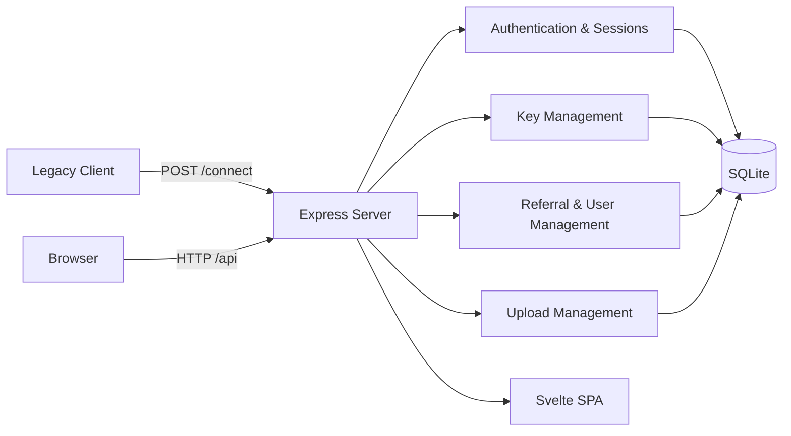

<div align="center">

# ⚡ SERVER-MOD ⚡

### Modern key-management platform with legacy `/connect` compatibility


</div>

> [!WARNING]
> **Security warning:** never commit production passwords, session secrets, private keys, database files, or real client credentials. Rotate every credential that has ever been exposed during development.

> [!IMPORTANT]
> The legacy source is preserved locally under `OLDSOURCE/` and maintained in the separate Git branch `legacy-source`. It is intentionally excluded from the `main` branch contents.

## ✨ Overview

SERVER-MOD is a migrated version of the original CodeIgniter/PHP application. The active application uses:

- **Node.js + Express** for the API and server runtime.
- **Svelte 5 + Vite** for the dashboard interface.
- **SQLite + better-sqlite3** for local, fast, transactional persistence.
- **Legacy-compatible `/connect`** for existing clients.
- Cookie-based authentication, sessions, role-based authorization, key CRUD, referrals, history, uploads, and balance management.

The original source is retained for protocol and behavior reference; the migrated application is developed from `main`.

## 🧭 Architecture



## 📦 Project structure

```text
server-mod/
├── backend/
│   ├── data/              # Runtime SQLite database and uploads (ignored)
│   ├── migrations/        # Data import scripts
│   └── src/               # Express application
├── frontend/
│   ├── src/               # Svelte pages, components, API client
│   └── vite.config.*
├── scripts/               # Workspace helper scripts
├── OLDSOURCE/             # Local legacy reference; ignored on main
├── package.json
└── README.md
```

## 🚀 Quick start

### Requirements

- Node.js 20 or newer
- npm 10 or newer
- Git

### Install dependencies

```bash
npm install
npm install --prefix backend
npm install --prefix frontend
```

### Start development mode

```bash
npm run dev
```

The frontend and backend start together. The API is mounted below `/api` and the server normally listens on port `3000`.

### Start production server

```bash
npm run build
npm start
```

The backend serves the built frontend from `dist/`.

## 🗃️ Existing data migration

The migration script imports the existing SQL data into SQLite:

```bash
npm run import
```

Before importing production data:

1. Back up the original database.
2. Stop writers against the source database.
3. Verify the destination database and record counts.
4. Test login, balance, keys, history, and `/connect` with a safe fixture.

Runtime data is intentionally excluded from Git through `.gitignore`.

## 🔌 Legacy `/connect` protocol

The public compatibility endpoint is:

```text
POST /connect
Content-Type: application/x-www-form-urlencoded
```

Required fields:

| Field | Description |
|---|---|
| `game` | Registered game identifier |
| `user_key` | Generated key |
| `serial` | Client device serial |

Example:

```bash
curl -X POST http://localhost:3000/connect \
  -H "Content-Type: application/x-www-form-urlencoded" \
  --data "game=PUGB&user_key=YOUR_KEY&serial=YOUR_SERIAL"
```

Successful responses preserve the legacy status value `279854` and include `data.real`, `data.token`, `data.rng`, `data.EXP`, and `data.expiry`.

Known error reasons:

- `INVALID PARAMETER`
- `USER OR GAME NOT REGISTERED`
- `EXPIRED KEY`
- `MAX DEVICE REACHED`

> [!NOTE]
> `/connect` is intentionally public for legacy clients and does not use dashboard login cookies. Protect the management API and server environment separately.

## 🔐 Main API areas

| Area | Routes |
|---|---|
| Authentication | `/api/login`, `/api/register`, `/api/logout`, `/api/session` |
| Dashboard | `/api/dashboard`, `/api/settings` |
| Keys | `/api/keys`, `/api/keys/generate`, `/api/keys/:id` |
| Legacy keys | `/keys/api`, `/keys/reset`, `/keys/delete` |
| Users | `/api/users`, `/api/users/:id` |
| Referrals | `/api/referrals` |
| Files | `/api/uploads`, `/api/uploads/:name` |
| Compatibility | `/connect` |

All authenticated browser requests use cookies with `credentials: include`.

## 👥 Roles

- **Level 1:** administrator access to users, referrals, uploads, and all keys.
- **Other levels:** scoped access to owned/registered keys and permitted dashboard actions.
- Inactive users cannot create a new session.

## 🧪 Validation checklist

Before release, verify:

- [ ] Login and logout work correctly.
- [ ] Session expiry redirects to login.
- [ ] Non-admin users cannot access admin pages or APIs.
- [ ] Key generation debits the expected fractional balance.
- [ ] Key search finds all expected records.
- [ ] Key edit preserves game, duration, devices, expiry, and registrator.
- [ ] `/connect` handles valid, expired, unknown, and max-device cases.
- [ ] Referral creation and registration work transactionally.
- [ ] Upload validation rejects unsupported extensions.
- [ ] No password hash appears in API responses.
- [ ] Production secrets and runtime data remain untracked.

## 🌿 Git branches

| Branch | Purpose |
|---|---|
| `main` | Active Node.js/Express/Svelte/SQLite migration |
| `legacy-source` | Preserved original CodeIgniter/PHP source |

`OLDSOURCE/` is ignored in the active working tree. To inspect the preserved legacy branch:

```bash
git switch legacy-source
```

Return to the migrated application:

```bash
git switch main
```

## ⚙️ Environment and deployment

Use environment variables or a secret manager for production configuration. Do not store secrets in tracked files.

Recommended production practices:

1. Run behind HTTPS and a reverse proxy.
2. Restrict access to the management dashboard.
3. Use secure, HttpOnly, SameSite cookies.
4. Back up SQLite before migrations and upgrades.
5. Monitor logs and failed authentication attempts.
6. Keep Node.js and dependencies updated.
7. Never expose `backend/data/` or upload storage as static content.

## 🛠️ Useful commands

```bash
npm run dev       # Frontend + backend development servers
npm run build     # Build the Svelte frontend
npm start         # Start the backend production server
npm test          # Run backend and frontend tests
npm run import    # Import existing data into SQLite
```

## 📄 License

Refer to the preserved legacy project license in the `legacy-source` branch. Confirm licensing requirements before redistributing or deploying the application.

<div align="center">


**Built for compatibility. Operated with care.** ⚡

</div>
